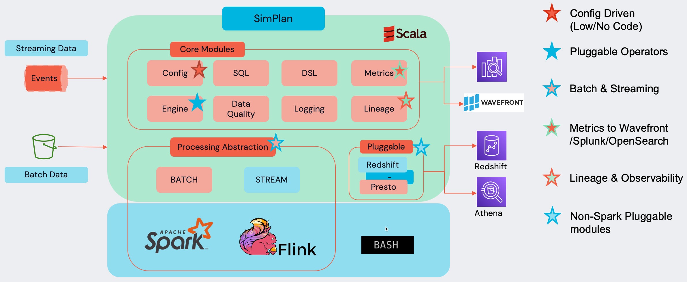

#Simplan for Data Process Authoring

For generating customer value from data, Data workers need to process large volumes of batch and streaming data. Separate codebase are maintained for Batch and Streaming modes which leads to siloed implementations for common data processing patterns. This leads to duplicate efforts from implementation to maintenance, hampering productivity. 

Users will be able to provide business logic as operators in a config file and the framework will take care of the rest. The framework will take care of the execution of these operators and provide the results to the user. The framework will also provide the lineage of the data and the metrics of the execution. 

### Simplam Tech Stack

Simplan framework offers a bunch of built-in operators for common processing tasks. These operators can be used as is or can be extended to add custom logic. The framework also provides a way to write custom operators.

### Features/Benefits
- Config Driven (Low/No code)
- Pluggable/Reusable operators for common processing tasks
- Multiple Execution Runtimes, Spark, Flink, Presto
- Abstraction over Execution Runtimes like Spark, Flink etc
- Batch and Streaming workloads
- External Integrations : Redshift, Athena, Kafka etc
- Built-In Quality control with circuit breakers.
- Lineage, Observability, and Metrics tracking.
- Integration for Intuit services like IDPS, Config Services, etc
- Improves developer productivity by 10-100 times
- Improves code quality, maintainability and reduces duplication

## Data Processing Implementations
### Simplan Spark (Successor to QuickETL)
Simplan Spark is an implementation of Simplan framework for Apache Spark execution engine. It provides a way to author batch and streaming operations in a simple way.

Learn more : [Simplan Spark](https://github.intuit.com/pages/Simplan/simplan-spark/)

### Simplan Flink
Learn More : [Simplan Flink](https://github.intuit.com/pages/Simplan/simplan-flink/)

### Simplan Presto
Learn More : [Simplan Presto](https://github.intuit.com/pages/Simplan/simplan-presto/)